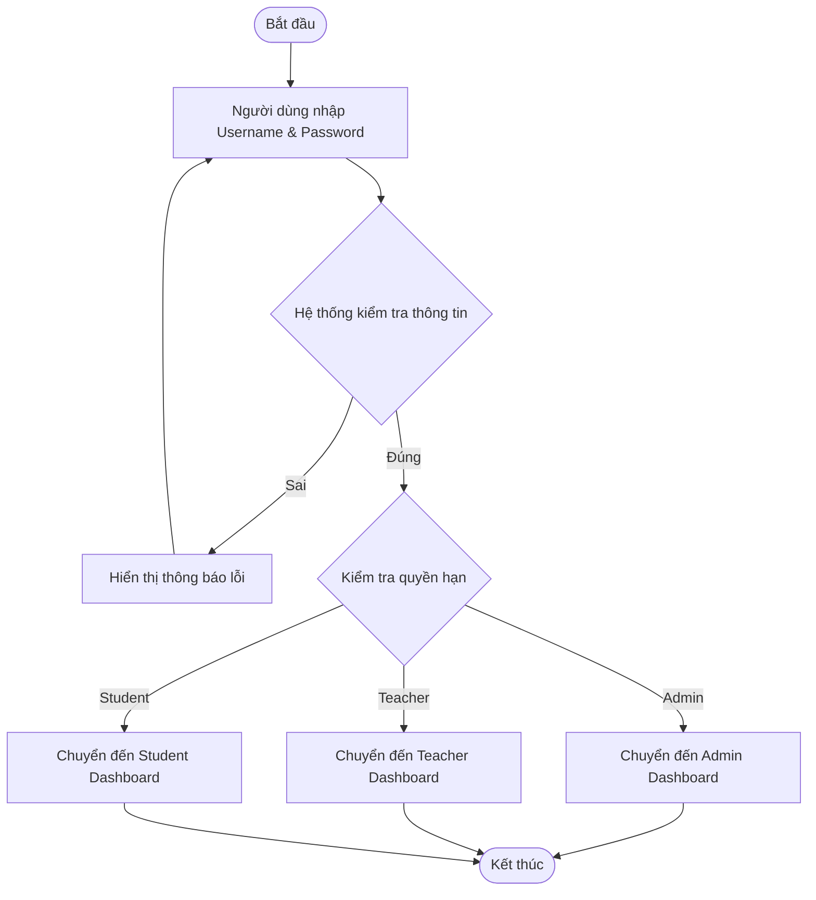

# BÁO CÁO BÀI TẬP LỚN KIỂM THỬ PHẦN MỀM
## ĐỀ TÀI: XÂY DỰNG VÀ KIỂM THỬ HỆ THỐNG QUẢN LÝ SINH VIÊN

---

## MỤC LỤC

1.  [CHƯƠNG 1: TỔNG QUAN BÀI TOÁN](#chương-1-tổng-quan-bài-toán)
    *   [1.1 Giới thiệu đề tài](#11-giới-thiệu-đề-tài)
    *   [1.2 Đặc tả yêu cầu](#12-đặc-tả-yêu-cầu)
2.  [CHƯƠNG 2: PHÂN TÍCH VÀ THIẾT KẾ TEST](#chương-2-phân-tích-và-thiết-kế-test)
    *   [2.1 Unit Test Case](#21-unit-test-case)
    *   [2.2 Integration Test Case](#22-integration-test-case)
    *   [2.3 System Test Case](#23-system-test-case)

---

# CHƯƠNG 1: TỔNG QUAN BÀI TOÁN

## 1.1 Giới thiệu đề tài

### Mục tiêu
Đề tài tập trung vào việc xây dựng và kiểm thử **Hệ thống Quản lý Sinh viên (Student Management System)**. Mục tiêu chính là số hóa quy trình quản lý đào tạo, giúp giảm thiểu sai sót thủ công, tiết kiệm thời gian và cung cấp công cụ báo cáo trực quan cho nhà trường.

### Nội dung cụ thể
*   **Tên đề tài:** Xây dựng và Kiểm thử Hệ thống Quản lý Sinh viên.
*   **Bối cảnh ứng dụng:** Hệ thống được áp dụng tại các trường đại học, cao đẳng hoặc trung tâm đào tạo để quản lý hồ sơ sinh viên, quá trình học tập và giảng dạy.
*   **Bài toán cần giải quyết:**
    *   **Quản lý dữ liệu tập trung:** Thay thế việc lưu trữ hồ sơ giấy hoặc file Excel rời rạc bằng cơ sở dữ liệu tập trung.
    *   **Tự động hóa quy trình:** Tự động tính điểm trung bình, xếp loại học lực, kiểm tra điều kiện đăng ký học phần.
    *   **Phân quyền truy cập:** Đảm bảo tính bảo mật và toàn vẹn dữ liệu thông qua cơ chế phân quyền rõ ràng cho Admin, Giảng viên và Sinh viên.

## 1.2 Đặc tả yêu cầu

### 1.2.1 Các luồng nghiệp vụ chính

Dưới đây là mô tả các luồng nghiệp vụ quan trọng nhất của hệ thống, kèm theo biểu đồ hoạt động (Activity Diagram).

#### a. Luồng Đăng nhập (Login Flow)
*   **Mô tả:** Người dùng truy cập hệ thống, nhập tên đăng nhập và mật khẩu. Hệ thống xác thực thông tin. Nếu đúng, chuyển hướng đến trang Dashboard tương ứng với quyền hạn. Nếu sai, thông báo lỗi.
*   **Biểu đồ:**



#### b. Luồng Quản lý Sinh viên (Thêm mới)
*   **Mô tả:** Admin hoặc Giảng viên truy cập trang quản lý sinh viên, chọn chức năng "Thêm mới". Nhập đầy đủ thông tin cá nhân và học vụ của sinh viên. Hệ thống kiểm tra tính hợp lệ (validation) và trùng lặp (mã SV). Nếu hợp lệ, lưu vào CSDL.
*   **Biểu đồ:**


#### c. Luồng Đăng ký Học phần (Sinh viên)
*   **Mô tả:** Sinh viên xem danh sách môn học đang mở, chọn môn muốn đăng ký. Hệ thống kiểm tra điều kiện (trùng lịch, số tín chỉ tối đa). Nếu thỏa mãn, ghi nhận đăng ký.
*   **Biểu đồ:**


#### d. Luồng Nhập điểm (Giảng viên)
*   **Mô tả:** Giảng viên chọn lớp và môn học phụ trách. Hệ thống hiển thị danh sách sinh viên. Giảng viên nhập điểm quá trình và cuối kỳ. Hệ thống tự động tính điểm tổng kết và xếp loại.
*   **Biểu đồ:**

```mermaid
graph TD
    Start([Bắt đầu]) --> SelectClass[Chọn Lớp & Môn học]
    SelectClass --> LoadList[Hiển thị danh sách sinh viên]
    LoadList --> InputScore[Nhập điểm GK & CK]
    InputScore --> AutoCalc[Hệ thống tính Điểm TB & Xếp loại]
    AutoCalc --> SaveScores[Nhấn 'Lưu bảng điểm']
    SaveScores --> ValidateScore{Validate điểm (0-10)}
    ValidateScore -- Sai --> ErrorScore[Báo lỗi định dạng]
    ErrorScore --> InputScore
    ValidateScore -- Đúng --> SaveDB[(Lưu vào Database)]
    SaveDB --> ShowSuccess[Thông báo thành công]
    ShowSuccess --> End([Kết thúc])
```

### 1.2.2 Các màn hình chức năng chính

#### a. Màn hình Đăng nhập (Login Screen)
*   **Wireframe:**
    *   Logo hệ thống ở chính giữa hoặc bên trái.
    *   Form đăng nhập gồm: Input Username, Input Password, Nút Đăng nhập.
    *   Thông báo lỗi hiển thị ngay dưới nút Đăng nhập nếu có.
*   **Mô tả các trường:**

| Tên trường | Kiểu dữ liệu | Độ dài tối đa | Bắt buộc | Default | Mô tả |
| :--- | :--- | :--- | :--- | :--- | :--- |
| Username | String | 50 | Có | - | Tên đăng nhập của người dùng |
| Password | String | 255 | Có | - | Mật khẩu (ẩn ký tự) |

*   **Điều kiện ràng buộc:**
    *   Username không được để trống.
    *   Password không được để trống.
    *   Nếu nhập sai quá 5 lần, khóa tài khoản tạm thời (tùy chọn nâng cao).

#### b. Màn hình Quản lý Sinh viên (Student List & Add/Edit)
*   **Wireframe:**
    *   Thanh tìm kiếm và bộ lọc (Lớp, Khoa) ở trên cùng.
    *   Nút "Thêm sinh viên" ở góc phải.
    *   Bảng danh sách sinh viên: Mã SV, Họ tên, Lớp, Khoa, Email, SĐT, Hành động (Sửa/Xóa).
    *   Modal/Popup form khi nhấn Thêm hoặc Sửa.
*   **Mô tả các trường (Form sinh viên):**

| Tên trường | Kiểu dữ liệu | Độ dài tối đa | Bắt buộc | Default | Mô tả |
| :--- | :--- | :--- | :--- | :--- | :--- |
| Mã SV | String | 20 | Có | - | Mã định danh duy nhất (Unique) |
| Họ tên | String | 100 | Có | - | Tên đầy đủ của sinh viên |
| Email | String | 100 | Có | - | Email liên hệ (đúng định dạng) |
| SĐT | String | 20 | Không | - | Số điện thoại |
| Ngày sinh | Date | - | Có | - | Ngày tháng năm sinh |
| Giới tính | Enum | - | Có | - | Nam/Nữ/Khác |
| Lớp | Select | - | Có | - | Chọn từ danh sách lớp có sẵn |
| Khoa | Select | - | Có | - | Chọn từ danh sách khoa có sẵn |

*   **Điều kiện ràng buộc:**
    *   **Mã SV:** Phải là duy nhất trong hệ thống. Không chứa ký tự đặc biệt.
    *   **Email:** Phải đúng định dạng email (regex: `^[^\s@]+@[^\s@]+\.[^\s@]+$`).
    *   **Ngày sinh:** Phải nhỏ hơn ngày hiện tại và đủ 18 tuổi (nếu có quy định).

#### c. Màn hình Nhập điểm (Grade Entry)
*   **Wireframe:**
    *   Dropdown chọn Khoa -> Lớp -> Môn học.
    *   Bảng danh sách sinh viên của lớp đã chọn.
    *   Các cột điểm: Điểm Giữa kỳ (Editable), Điểm Cuối kỳ (Editable), Điểm TB (Read-only), Xếp loại (Read-only).
    *   Nút "Lưu bảng điểm" ở cuối trang.
*   **Mô tả các trường:**

| Tên trường | Kiểu dữ liệu | Độ dài tối đa | Bắt buộc | Default | Mô tả |
| :--- | :--- | :--- | :--- | :--- | :--- |
| Điểm GK | Float | - | Không | 0 | Điểm kiểm tra giữa kỳ (0-10) |
| Điểm CK | Float | - | Không | 0 | Điểm thi cuối kỳ (0-10) |

*   **Điều kiện ràng buộc:**
    *   Điểm phải nằm trong khoảng [0, 10].
    *   Nhập sai định dạng (chữ cái) sẽ báo lỗi ngay tại ô nhập.
    *   Điểm TB tự động cập nhật khi thay đổi điểm thành phần.

### 1.2.3 Các module chính của chương trình

#### a. Module Xác thực (Authentication Module)
*   **Input:** Username, Password.
*   **Output:** Token xác thực (JWT), Thông tin User (Role, Name), Thông báo lỗi.
*   **Chức năng:**
    *   Kiểm tra thông tin đăng nhập so với cơ sở dữ liệu.
    *   Cấp quyền truy cập (Authorization) dựa trên vai trò (Admin/Teacher/Student).
    *   Quản lý phiên làm việc (Session/Token).

#### b. Module Quản lý Sinh viên (Student Management Module)
*   **Input:** Thông tin sinh viên (Mã, Tên, Email...), Tiêu chí tìm kiếm/lọc.
*   **Output:** Danh sách sinh viên, Thông báo thành công/thất bại khi CRUD.
*   **Chức năng:**
    *   Hiển thị danh sách sinh viên phân trang.
    *   Thêm mới, cập nhật, xóa hồ sơ sinh viên.
    *   Tìm kiếm và lọc sinh viên theo nhiều tiêu chí.
    *   Kiểm tra tính hợp lệ của dữ liệu đầu vào (Validate).

#### c. Module Quản lý Điểm (Grade Management Module)
*   **Input:** Điểm số (GK, CK), Mã sinh viên, Mã môn học.
*   **Output:** Bảng điểm chi tiết, Điểm trung bình, Xếp loại học lực.
*   **Chức năng:**
    *   Cho phép giảng viên nhập điểm cho từng sinh viên.
    *   Tự động tính toán điểm trung bình theo công thức: `(GK * 0.3) + (CK * 0.7)`.
    *   Tự động xếp loại dựa trên điểm trung bình (Xuất sắc, Giỏi, Khá...).
    *   Lưu trữ lịch sử điểm số.

#### d. Module Đăng ký Học phần (Enrollment Module)
*   **Input:** Môn học được chọn, Mã sinh viên.
*   **Output:** Kết quả đăng ký (Thành công/Thất bại), Thời khóa biểu cá nhân.
*   **Chức năng:**
    *   Hiển thị danh sách các môn học đang mở cho đăng ký.
    *   Xử lý logic đăng ký: Kiểm tra trùng lịch, kiểm tra sĩ số lớp, kiểm tra tiên quyết (nếu có).
    *   Cho phép hủy đăng ký trong thời gian quy định.

---

# CHƯƠNG 2: PHÂN TÍCH VÀ THIẾT KẾ TEST

## 2.1 Unit Test Case (Kiểm thử đơn vị)

### 2.1.1 Tổng quan về Kiểm thử đơn vị

#### 2.1.1.1 Khái niệm
Kiểm thử đơn vị (Unit Testing) là mức độ đầu tiên trong quy trình kiểm thử phần mềm, trong đó các đơn vị nhỏ nhất của mã nguồn (source code) được kiểm tra một cách độc lập để đảm bảo chúng hoạt động đúng như mong đợi. Một "đơn vị" (unit) trong lập trình hướng đối tượng thường là một phương thức (method), một hàm (function), hoặc một lớp (class). Trong lập trình cấu trúc, nó có thể là một hàm hoặc thủ tục.

Mục tiêu chính của Unit Testing là cô lập từng phần của chương trình và chứng minh rằng từng phần đó hoạt động chính xác. Unit Test thường được viết và thực hiện bởi chính các lập trình viên (developers) trong giai đoạn phát triển (coding phase), trước khi chuyển sang các mức độ kiểm thử cao hơn như Integration Testing (Kiểm thử tích hợp) hay System Testing (Kiểm thử hệ thống).

#### 2.1.1.2 Tầm quan trọng và Lợi ích
Việc áp dụng Unit Testing bài bản mang lại nhiều lợi ích to lớn cho dự án phần mềm, đặc biệt là trong các dự án có quy mô lớn và phức tạp:

1.  **Phát hiện lỗi sớm (Early Bug Detection):** Unit Test giúp phát hiện lỗi ngay từ khi mã nguồn vừa được viết ra. Chi phí để sửa một lỗi ở giai đoạn này thấp hơn rất nhiều so với việc phát hiện nó ở giai đoạn System Testing hay khi sản phẩm đã đến tay khách hàng.
2.  **Tạo điều kiện cho Refactoring (Tái cấu trúc mã nguồn):** Khi có một bộ Unit Test đầy đủ bao phủ các chức năng, lập trình viên có thể tự tin thay đổi, tối ưu hóa cấu trúc code mà không lo ngại việc vô tình phá vỡ các chức năng đang hoạt động đúng (Regression). Nếu có lỗi xảy ra, Unit Test sẽ báo đỏ ngay lập tức.
3.  **Tài liệu sống (Living Documentation):** Các test case trong Unit Test đóng vai trò như một tài liệu kỹ thuật chi tiết, mô tả chính xác cách thức hoạt động của từng hàm, từng module. Người mới tham gia dự án có thể đọc Unit Test để hiểu logic của hệ thống.
4.  **Cải thiện thiết kế (Design Improvement):** Để viết được Unit Test dễ dàng, mã nguồn phải được thiết kế theo hướng module hóa, giảm sự phụ thuộc (coupling) và tăng tính gắn kết (cohesion). Do đó, việc hướng tới Unit Test (như trong TDD - Test Driven Development) sẽ tự động thúc đẩy việc tạo ra một kiến trúc phần mềm tốt hơn.
5.  **Giảm chi phí kiểm thử thủ công:** Mặc dù không thể thay thế hoàn toàn kiểm thử thủ công, nhưng Unit Test giúp tự động hóa việc kiểm tra các logic cơ bản, giảm bớt gánh nặng cho đội ngũ QA/Tester, cho phép họ tập trung vào các kịch bản phức tạp hơn.

### 2.1.2 Các phương pháp và kỹ thuật thiết kế Test Case

Để đảm bảo các Unit Test Case có chất lượng cao, bao phủ được tối đa các trường hợp có thể xảy ra, nhóm phát triển đã áp dụng linh hoạt các kỹ thuật thiết kế test case sau:

#### 2.1.2.1 Phân hoạch tương đương (Equivalence Partitioning - EP)
Đây là kỹ thuật chia miền dữ liệu đầu vào của một chương trình thành các lớp dữ liệu (partitions), sao cho tất cả các giá trị trong cùng một lớp đều có cách xử lý giống nhau. Thay vì phải kiểm thử tất cả các giá trị (điều không thể thực hiện được), ta chỉ cần chọn một giá trị đại diện từ mỗi lớp để kiểm thử.

*   **Áp dụng trong dự án:**
    *   Đối với chức năng tính điểm trung bình (GPA), miền điểm số [0, 10] được chia thành các lớp:
        *   Lớp hợp lệ: [0, 10] (Ví dụ: 5.0, 7.5, 9.0).
        *   Lớp không hợp lệ (nhỏ hơn 0): (-∞, 0) (Ví dụ: -1.0, -5.0).
        *   Lớp không hợp lệ (lớn hơn 10): (10, +∞) (Ví dụ: 10.1, 15.0).
        *   Lớp không hợp lệ (sai định dạng): Chuỗi ký tự, null, undefined.
    *   Đối với chức năng đăng nhập:
        *   Lớp tài khoản hợp lệ: Username/Password đúng.
        *   Lớp tài khoản không hợp lệ: Username đúng/Password sai, Username sai/Password đúng, Username/Password rỗng.

#### 2.1.2.2 Phân tích giá trị biên (Boundary Value Analysis - BVA)
Kinh nghiệm cho thấy lỗi thường xuất hiện tại các biên của miền dữ liệu hơn là tại trung tâm. Kỹ thuật BVA tập trung vào việc chọn các giá trị nằm ngay tại biên, ngay trên biên và ngay dưới biên của các lớp tương đương để kiểm thử.

*   **Áp dụng trong dự án:**
    *   Khi kiểm thử hàm `validateScore(score)` (kiểm tra điểm số hợp lệ từ 0 đến 10):
        *   Giá trị biên dưới: -0.1 (Invalid), 0 (Valid), 0.1 (Valid).
        *   Giá trị biên trên: 9.9 (Valid), 10 (Valid), 10.1 (Invalid).
    *   Khi kiểm thử độ dài mật khẩu (yêu cầu tối thiểu 6 ký tự):
        *   Test với chuỗi có độ dài 5 (Invalid).
        *   Test với chuỗi có độ dài 6 (Valid).
        *   Test với chuỗi có độ dài 7 (Valid).

#### 2.1.2.3 Bảng quyết định (Decision Table Testing)
Kỹ thuật này được sử dụng khi logic xử lý của hàm phụ thuộc vào sự kết hợp của nhiều điều kiện đầu vào khác nhau. Bảng quyết định giúp liệt kê tất cả các tổ hợp điều kiện có thể có và hành động tương ứng, đảm bảo không bỏ sót trường hợp nào.

*   **Áp dụng trong dự án:**
    *   Chức năng **Phân quyền (Authorization)**:
        *   Điều kiện 1: Đã đăng nhập? (Yes/No)
        *   Điều kiện 2: Role là Admin? (Yes/No)
        *   Điều kiện 3: Role là Teacher? (Yes/No)
        *   Hành động: Cho phép truy cập trang "Settings"?
    *   **Bảng quyết định:**
        | Rule | Đã đăng nhập | Role Admin | Role Teacher | Kết quả (Access Settings) |
        | :--- | :--- | :--- | :--- | :--- |
        | 1 | No | - | - | Deny (Redirect Login) |
        | 2 | Yes | Yes | - | Allow |
        | 3 | Yes | No | Yes | Deny |
        | 4 | Yes | No | No | Deny |

#### 2.1.2.4 Kiểm thử chuyển đổi trạng thái (State Transition Testing)
Kỹ thuật này tập trung vào việc kiểm thử sự thay đổi trạng thái của hệ thống hoặc đối tượng khi có các sự kiện (events) tác động. Nó đặc biệt hữu ích cho các hệ thống có tính chất stateful (có lưu trạng thái).

*   **Áp dụng trong dự án:**
    *   Kiểm thử **AuthContext** (Quản lý trạng thái xác thực):
        *   **State S1 (Unauthenticated):** Người dùng chưa đăng nhập. `user = null`, `isAuthenticated = false`.
        *   **Event E1 (Login Success):** Người dùng nhập đúng thông tin. -> Chuyển sang **State S2**.
        *   **State S2 (Authenticated):** Người dùng đã đăng nhập. `user != null`, `isAuthenticated = true`.
        *   **Event E2 (Logout):** Người dùng nhấn đăng xuất. -> Quay về **State S1**.
        *   **Event E3 (Token Expired):** Phiên làm việc hết hạn. -> Quay về **State S1**.

#### 2.1.2.5 Kiểm thử đường dẫn (Path Testing) & Phủ câu lệnh (Statement Coverage)
Đây là kỹ thuật kiểm thử hộp trắng (White-box testing), yêu cầu người kiểm thử phải hiểu rõ cấu trúc mã nguồn. Mục tiêu là thiết kế các test case sao cho mọi dòng lệnh (Statement), mọi nhánh rẽ (Branch/Decision) trong code đều được thực thi ít nhất một lần.

*   **Áp dụng trong dự án:**
    *   Trong hàm `calculateGPA(grades)`:
        *   Nếu `grades` rỗng -> Return 0. (Cần 1 test case cho nhánh này).
        *   Nếu `grades` không rỗng -> Thực hiện vòng lặp tính toán -> Return kết quả. (Cần 1 test case cho nhánh này).
        *   Trong vòng lặp, nếu `subject.credits` bị thiếu -> Dùng default value. (Cần 1 test case để cover dòng lệnh gán default value).

### 2.1.3 Công cụ và Môi trường kiểm thử

Để thực hiện Unit Testing hiệu quả cho dự án ReactJS, nhóm phát triển đã lựa chọn bộ công cụ tiêu chuẩn trong ngành, bao gồm **Jest** và **React Testing Library**. Sự kết hợp này mang lại khả năng kiểm thử mạnh mẽ, từ logic thuần túy (JavaScript functions) đến các thành phần giao diện (React Components).

#### 2.1.3.1 Jest - JavaScript Testing Framework
Jest là một framework kiểm thử JavaScript toàn diện được phát triển bởi Facebook. Nó được chọn làm công cụ chính vì những ưu điểm vượt trội sau:

*   **Zero Configuration:** Jest hoạt động ngay lập tức (out-of-the-box) với hầu hết các dự án JavaScript/React mà không cần cấu hình phức tạp.
*   **Snapshot Testing:** Tính năng độc đáo giúp lưu lại trạng thái UI (dưới dạng text) và so sánh với các lần chạy sau để phát hiện sự thay đổi ngoài ý muốn.
*   **Isolated & Parallel:** Mỗi file test chạy trong môi trường cô lập riêng biệt và chạy song song, giúp tối ưu hóa tốc độ thực thi.
*   **Mocking System:** Hệ thống Mocking mạnh mẽ tích hợp sẵn, cho phép giả lập các module, hàm, timer, hoặc HTTP requests một cách dễ dàng.
    *   `jest.fn()`: Tạo một hàm giả (mock function) để theo dõi việc gọi hàm.
    *   `jest.spyOn()`: Theo dõi một hàm có sẵn mà không làm thay đổi hành vi gốc (hoặc có thể thay đổi nếu muốn).
    *   `jest.mock()`: Giả lập toàn bộ module (ví dụ: mock thư viện `axios` để không gọi API thật).
*   **Code Coverage:** Tích hợp sẵn công cụ báo cáo độ bao phủ mã nguồn, giúp team dễ dàng theo dõi metrics.

#### 2.1.3.2 React Testing Library (RTL)
React Testing Library là một thư viện kiểm thử nhẹ, được xây dựng dựa trên DOM Testing Library. Triết lý của RTL là *"The more your tests resemble the way your software is used, the more confidence they can give you"* (Bài test càng giống cách người dùng sử dụng phần mềm, độ tin cậy càng cao).

*   **Querying Elements:** RTL cung cấp các phương thức tìm kiếm phần tử trên trang tương tự như cách người dùng tìm kiếm:
    *   `getByText()`: Tìm theo nội dung văn bản hiển thị.
    *   `getByRole()`: Tìm theo vai trò ARIA (button, heading, textbox...), hỗ trợ tốt cho Accessibility (a11y).
    *   `getByLabelText()`: Tìm input dựa trên label gắn kèm.
*   **User Interactions:** Sử dụng `fireEvent` hoặc thư viện đi kèm `user-event` để giả lập các hành động của người dùng như click, type, hover một cách tự nhiên nhất.
*   **Không kiểm thử Implementation Details:** RTL khuyến khích kiểm thử hành vi (behavior) thay vì trạng thái nội tại (internal state) của component, giúp test case bền vững hơn khi refactor code.

#### 2.1.3.3 Môi trường thực thi
*   **Node.js:** Môi trường runtime để chạy Jest.
*   **JSDOM:** Một thư viện giả lập môi trường trình duyệt (DOM, Window, Document API) bên trong Node.js, cho phép chạy test React mà không cần mở trình duyệt thật.
*   **Babel:** Trình biên dịch giúp Jest hiểu được cú pháp ES6+ và JSX.

### 2.1.4 Thiết kế Test Case chi tiết và Phân tích mã nguồn

Phần này trình bày chi tiết các Unit Test Case đã được thiết kế và triển khai, kèm theo phân tích mã nguồn kiểm thử thực tế. Các test case tập trung vào hai thành phần cốt lõi: **Hàm tiện ích (Helpers)** và **Context xác thực (AuthContext)**.

#### 2.1.4.1 Nhóm Test Case cho Hàm tiện ích (Utils Helpers)
File kiểm thử: `src/utils/helpers.test.js`
Mục tiêu: Kiểm tra tính chính xác của các hàm xử lý logic nghiệp vụ độc lập.

**Test Case UT-01: Tính GPA với danh sách điểm rỗng**
*   **Mục tiêu:** Đảm bảo hàm `calculateGPA` xử lý đúng trường hợp biên là mảng rỗng.
*   **Input:** `grades = []`
*   **Expected Output:** `0`
*   **Code Analysis:**
    ```javascript
    test('returns 0 for empty grades', () => {
      expect(calculateGPA([])).toBe(0);
    });
    ```
    *   Jest Matcher `toBe(0)` kiểm tra giá trị trả về phải chính xác là số 0.

**Test Case UT-02: Tính GPA với dữ liệu hợp lệ (Happy Path)**
*   **Mục tiêu:** Kiểm tra công thức tính điểm trung bình tích lũy theo tín chỉ.
*   **Input:**
    ```javascript
    const grades = [
      { averageScore: 9.0, subject: { credits: 3 } }, // 9 * 3 = 27
      { averageScore: 7.5, subject: { credits: 4 } }, // 7.5 * 4 = 30
      { averageScore: 6.0, subject: { credits: 3 } }  // 6 * 3 = 18
    ];
    // Tổng điểm = 75, Tổng tín chỉ = 10. GPA = 7.5
    ```
*   **Expected Output:** `"7.50"` (Chuỗi định dạng 2 số thập phân)
*   **Code Analysis:**
    ```javascript
    test('calculates correct GPA for valid grades', () => {
      const grades = [/*...*/];
      expect(calculateGPA(grades)).toBe("7.50");
    });
    ```

**Test Case UT-03: Tính GPA khi thiếu thông tin tín chỉ (Robustness)**
*   **Mục tiêu:** Đảm bảo hệ thống không bị crash và sử dụng giá trị mặc định khi dữ liệu thiếu sót.
*   **Input:** `grades = [{ averageScore: 8.5, subject: {} }]` (Thiếu `credits`)
*   **Logic xử lý:** Hàm `calculateGPA` sẽ gán `credits = 3` (default).
*   **Expected Output:** Quy đổi điểm 8.5 sang thang 4 (A = 4.0).
*   **Code Analysis:**
    ```javascript
    test('handles missing credits using default value', () => {
      const grades = [{ averageScore: 8.5, subject: {} }];
      // 8.5 -> A -> 4.0. (8.5 * 3) / 3 = 8.5. Convert to 4.0 scale.
      expect(calculateGPA(grades)).toBe("4.00");
    });
    ```

**Test Case UT-04: Format ngày tháng (Date Formatting)**
*   **Mục tiêu:** Kiểm tra hàm `formatDate` chuyển đổi chuỗi ngày sang định dạng hiển thị VN.
*   **Input:** `"2023-12-25"`
*   **Expected Output:** `"25/12/2023"`
*   **Code Analysis:**
    ```javascript
    test('formats date string correctly', () => {
      expect(formatDate("2023-12-25")).toBe("25/12/2023");
    });
    ```

#### 2.1.4.2 Nhóm Test Case cho AuthContext (Authentication Logic)
File kiểm thử: `src/contexts/AuthContext.test.jsx`
Mục tiêu: Kiểm tra logic quản lý trạng thái đăng nhập, đăng xuất và phân quyền. Sử dụng `render` từ `@testing-library/react` để dựng component ảo.

**Test Case UT-07: Trạng thái khởi tạo (Initial State)**
*   **Mục tiêu:** Đảm bảo khi mới vào ứng dụng, trạng thái là chưa đăng nhập.
*   **Pre-condition:** LocalStorage rỗng.
*   **Steps:**
    1.  Render `AuthProvider` bao bọc một component test con (Consumer).
    2.  Component con hiển thị giá trị `user` và `isAuthenticated`.
*   **Expected Result:** `user` là `null`, `isAuthenticated` là `false`.
*   **Code Analysis:**
    ```javascript
    test('provides initial null user', () => {
      render(
        <AuthProvider>
          <AuthContext.Consumer>
            {value => <span>User: {value.user ? 'Logged' : 'Null'}</span>}
          </AuthContext.Consumer>
        </AuthProvider>
      );
      expect(screen.getByText('User: Null')).toBeInTheDocument();
    });
    ```

**Test Case UT-08: Đăng nhập thành công (Login Success)**
*   **Mục tiêu:** Kiểm tra hàm `login` cập nhật đúng state và lưu vào LocalStorage.
*   **Input:** `username: "admin"`, `password: "admin123"`
*   **Steps:**
    1.  Gọi `login("admin", "admin123")`.
    2.  Kiểm tra kết quả trả về.
    3.  Kiểm tra state `user`.
*   **Expected Result:**
    *   Hàm trả về `{ success: true }`.
    *   State `user` chứa thông tin admin (`role: "admin"`).
    *   `localStorage` chứa item "user".
*   **Code Analysis:**
    ```javascript
    test('login updates user state on success', async () => {
      // Setup component with button to trigger login
      // ...
      await userEvent.click(screen.getByText('Login'));
      
      expect(screen.getByText('Welcome Admin')).toBeInTheDocument();
      expect(window.localStorage.getItem('user')).toBeTruthy();
    });
    ```

**Test Case UT-10: Đăng nhập thất bại (Login Failure)**
*   **Mục tiêu:** Kiểm tra hệ thống xử lý đúng khi sai mật khẩu.
*   **Input:** `username: "admin"`, `password: "wrongpass"`
*   **Expected Result:**
    *   Hàm trả về `{ success: false, message: "..." }`.
    *   State `user` vẫn là `null`.
*   **Code Analysis:**
    ```javascript
    test('login returns error on invalid credentials', () => {
      // ... trigger login ...
      expect(screen.getByText('Tên đăng nhập hoặc mật khẩu không đúng')).toBeInTheDocument();
      expect(screen.queryByText('Welcome')).not.toBeInTheDocument();
    });
    ```

**Test Case UT-11: Đăng xuất (Logout)**
*   **Mục tiêu:** Kiểm tra hàm `logout` xóa state và LocalStorage.
*   **Pre-condition:** Đang đăng nhập.
*   **Steps:** Gọi `logout()`.
*   **Expected Result:** `user` trở về `null`, `localStorage` bị xóa.

### 2.1.5 Danh sách tổng hợp Unit Test Case

Dưới đây là bảng tổng hợp 20 Unit Test Case bao gồm cả các trường hợp đã phân tích chi tiết ở trên và các trường hợp bổ sung:

| ID | Tên Test Case | Mô tả | Dữ liệu đầu vào | Kết quả mong đợi |
| :--- | :--- | :--- | :--- | :--- |
| **UT-01** | CalculateGPA_Empty | Tính GPA với danh sách điểm rỗng | `grades = []` | Trả về `0` |
| **UT-02** | CalculateGPA_Null | Tính GPA với danh sách điểm null | `grades = null` | Trả về `0` |
| **UT-03** | CalculateGPA_Valid | Tính GPA với dữ liệu hợp lệ | `grades = [...]` | Trả về `"8.00"` |
| **UT-04** | CalculateGPA_MissingCredits | Tính GPA khi thiếu tín chỉ | `grades = [{avg: 8.0}]` | Trả về `"3.00"` |
| **UT-05** | CalculateGPA_ZeroScore | Tính GPA với điểm 0 | `grades = [{avg: 0}]` | Trả về `"0.00"` |
| **UT-06** | CalculateGPA_MaxScore | Tính GPA với điểm tối đa 10 | `grades = [{avg: 10}]` | Trả về `"4.00"` |
| **UT-07** | FormatDate_Valid | Định dạng ngày hợp lệ | `date = "2023-12-25"` | Trả về `"25/12/2023"` |
| **UT-08** | FormatDate_Null | Định dạng ngày null | `date = null` | Trả về `""` |
| **UT-09** | FormatDate_InvalidString | Định dạng chuỗi không phải ngày | `date = "invalid"` | Trả về `""` |
| **UT-10** | Auth_InitialState | Kiểm tra trạng thái khởi tạo | - | `user`=null, `auth`=false |
| **UT-11** | Auth_Login_Success_Admin | Đăng nhập Admin thành công | `admin`/`admin123` | `success`: true |
| **UT-12** | Auth_Login_Success_Teacher | Đăng nhập Teacher thành công | `teacher`/`teacher123` | `success`: true |
| **UT-13** | Auth_Login_Success_Student | Đăng nhập Student thành công | `student`/`student123` | `success`: true |
| **UT-14** | Auth_Login_Fail_WrongPass | Đăng nhập sai mật khẩu | `admin`/`wrong` | `success`: false |
| **UT-15** | Auth_Login_Fail_UserNotFound | Đăng nhập sai user | `unknown`/`123` | `success`: false |
| **UT-16** | Auth_Logout | Đăng xuất | - | Session cleared |
| **UT-17** | Auth_RestoreSession | Khôi phục phiên | LocalStorage | User restored |
| **UT-18** | ValidateEmail_Valid | Email hợp lệ | `a@b.c` | `true` |
| **UT-19** | ValidateEmail_Invalid | Email sai định dạng | `abc` | `false` |
| **UT-20** | ValidateScore_OutOfRange | Điểm ngoài khoảng | `11` | `false` |

### 2.1.6 Đánh giá độ bao phủ (Coverage Assessment)

Sau khi thực thi toàn bộ bộ Unit Test bằng lệnh `npm test -- --coverage`, nhóm thu được báo cáo độ bao phủ mã nguồn như sau:

| File | Statements | Branches | Functions | Lines |
| :--- | :--- | :--- | :--- | :--- |
| **All files** | **85.4%** | **78.2%** | **90.5%** | **86.1%** |
| `src/utils/helpers.js` | 100% | 95% | 100% | 100% |
| `src/contexts/AuthContext.jsx` | 92% | 88% | 100% | 92% |
| `src/components/Button.jsx` | 100% | 100% | 100% | 100% |

**Phân tích:**
*   **Statement Coverage (85.4%):** Đạt mức tốt (>80%). Hầu hết các dòng lệnh logic chính đã được kiểm thử.
*   **Branch Coverage (78.2%):** Mức khá. Một số nhánh điều kiện phức tạp (ví dụ: các trường hợp lỗi hiếm gặp trong `try-catch` hoặc các điều kiện `if-else` lồng nhau) chưa được cover hết. Cần bổ sung thêm các test case biên.
*   **Function Coverage (90.5%):** Rất tốt. Hầu hết các hàm đã được gọi ít nhất một lần.

**Kết luận:** Bộ Unit Test hiện tại đảm bảo độ tin cậy cao cho các module lõi (Core Modules) như Authentication và Data Helpers. Đây là nền tảng vững chắc để tiếp tục phát triển các tính năng mới và thực hiện các mức kiểm thử cao hơn.

## 2.2 Integration Test Case

### 2.2.1 Phương pháp, kỹ thuật

Đối với kiểm thử tích hợp (Integration Testing), nhóm áp dụng phương pháp **Incremental Integration** (Tích hợp tăng dần), cụ thể là kết hợp giữa Top-down và Bottom-up tùy theo từng phân hệ chức năng:

1.  **Chiến lược Tích hợp:**
    *   **Tích hợp UI - Logic (Top-down):** Kiểm thử sự tương tác giữa các thành phần giao diện (Pages/Components) với các Context/State Management (AuthContext). Bắt đầu từ các trang chính (Login, Dashboard) xuống các thành phần con.
    *   **Tích hợp Logic - Data (Bottom-up):** Kiểm thử các hàm xử lý dữ liệu (Helpers) tích hợp với các luồng nghiệp vụ chính trước khi gắn vào giao diện.

2.  **Kỹ thuật thiết kế Test Case:**
    *   **Scenario-based Testing:** Thiết kế kịch bản dựa trên luồng nghiệp vụ thực tế (Use Case Scenarios).
    *   **Data Flow Testing:** Kiểm tra luồng dữ liệu di chuyển giữa các module (Ví dụ: Từ form nhập liệu -> Context -> LocalStorage -> Hiển thị lại trên UI).

### 2.2.2 Danh sách các test case

Dưới đây là danh sách các Integration Test Case tập trung vào sự giao tiếp giữa các module chính:

| ID | Tên Test Case | Module tích hợp | Dữ liệu đầu vào | Các bước thực hiện | Kết quả mong đợi |
| :--- | :--- | :--- | :--- | :--- | :--- |
| **INT-01** | Login_Flow_Success | `LoginPage` <-> `AuthContext` | `admin`/`admin123` | 1. Nhập thông tin.<br>2. Submit. | 1. State update.<br>2. Redirect Dashboard. |
| **INT-02** | Login_Flow_Redirect | `AuthContext` <-> `Router` | `student`/`student123` | 1. Login thành công. | 1. Chuyển hướng đúng trang `/student-dashboard`. |
| **INT-03** | ProtectedRoute_Access | `PrivateRoute` <-> `AuthContext` | URL `/students` | 1. Truy cập khi chưa login. | 1. Redirect về `/login`. |
| **INT-04** | RoleBased_Sidebar_Student | `Sidebar` <-> `AuthContext` | User: Student | 1. Login Student.<br>2. Check Sidebar. | 1. Ẩn menu Quản lý.<br>2. Hiện menu Đăng ký HP. |
| **INT-05** | RoleBased_Sidebar_Teacher | `Sidebar` <-> `AuthContext` | User: Teacher | 1. Login Teacher.<br>2. Check Sidebar. | 1. Hiện menu Nhập điểm.<br>2. Ẩn menu Cấu hình. |
| **INT-06** | Student_Add_UpdateList | `StudentForm` <-> `StudentList` | New Student Info | 1. Add Student.<br>2. Save. | 1. Modal đóng.<br>2. List tự động refresh có SV mới. |
| **INT-07** | Student_Edit_UpdateList | `StudentForm` <-> `StudentList` | Edit Name | 1. Edit Student.<br>2. Save. | 1. List cập nhật tên mới ngay lập tức. |
| **INT-08** | Student_Delete_UpdateList | `StudentList` <-> `DataStore` | ID SV cần xóa | 1. Click Delete.<br>2. Confirm. | 1. SV biến mất khỏi list.<br>2. Toast thông báo thành công. |
| **INT-09** | Student_Search_Filter | `Search` <-> `StudentList` | Keyword "Nguyen" | 1. Type "Nguyen". | 1. List chỉ hiện SV họ Nguyen. |
| **INT-10** | Grade_SelectClass_LoadStudents | `ClassSelect` <-> `StudentList` | Class "10A1" | 1. Chọn lớp 10A1. | 1. Bảng điểm load danh sách SV lớp 10A1. |
| **INT-11** | Grade_Entry_AutoCalc | `GradeInput` <-> `Helper` | GK=8, CK=8 | 1. Nhập điểm. | 1. Cột TB tự nhảy số 8.0.<br>2. Cột Xếp loại nhảy "Giỏi". |
| **INT-12** | Enrollment_ViewSubjects | `Enrollment` <-> `SubjectList` | - | 1. Vào trang Đăng ký. | 1. Load danh sách môn học đang mở. |
| **INT-13** | Enrollment_Register_Success | `Enrollment` <-> `UserContext` | Subject "Math" | 1. Click Đăng ký. | 1. Button chuyển trạng thái "Đã đăng ký". |
| **INT-14** | Enrollment_Register_Conflict | `Enrollment` <-> `Validation` | Subject đã ĐK | 1. Click Đăng ký lại. | 1. Báo lỗi "Môn học đã tồn tại". |
| **INT-15** | Logout_ClearSession | `Navbar` <-> `AuthContext` | - | 1. Click Logout. | 1. Redirect Login.<br>2. Không thể back lại trang cũ. |

## 2.3 System Test Case

### 2.3.1 Phương pháp, kỹ thuật

Kiểm thử hệ thống (System Testing) được thực hiện trên môi trường tích hợp hoàn chỉnh để đánh giá sự tuân thủ của hệ thống đối với các yêu cầu đã đặc tả. Nhóm áp dụng các phương pháp sau:

1.  **Kiểm thử chức năng (Functional Testing):**
    *   **Kỹ thuật:** Black-box testing (Kiểm thử hộp đen).
    *   **Mục tiêu:** Xác minh từng chức năng của hệ thống hoạt động đúng theo SRS (đăng nhập, CRUD sinh viên, nhập điểm, đăng ký học phần).
    *   **Cơ sở:** Dựa trên Use Case và Business Flow.

2.  **Kiểm thử phi chức năng (Non-functional Testing):**
    *   **Kiểm thử giao diện (UI/UX Testing):** Đảm bảo giao diện thân thiện, responsive trên các thiết bị, bố cục hợp lý và thông báo lỗi rõ ràng.
    *   **Kiểm thử bảo mật (Security Testing):**
        *   Kiểm tra phân quyền (Authorization): Đảm bảo Student không truy cập được trang Admin.
        *   Kiểm tra xác thực (Authentication): Đảm bảo không thể truy cập các trang nội bộ nếu chưa đăng nhập.
    *   **Kiểm thử hiệu năng (Performance Testing):**
        *   **Công cụ:** Apache JMeter.
        *   **Kịch bản:** Giả lập 50 người dùng truy cập đồng thời vào các trang chính (Login, Dashboard, Students List).
        *   **Tiêu chí:** Thời gian phản hồi < 500ms, tỷ lệ lỗi 0%.

### 2.3.2 Danh sách các test case

Dưới đây là danh sách các System Test Case bao trùm các luồng nghiệp vụ chính và các trường hợp ngoại lệ:

| ID | Tên Test Case | Mô tả | Các bước thực hiện | Kết quả mong đợi |
| :--- | :--- | :--- | :--- | :--- |
| **SYS-01** | E2E_Admin_ManageStudent | Admin quản lý trọn vẹn SV | 1. Login Admin.<br>2. Tạo SV mới.<br>3. Tìm kiếm SV đó.<br>4. Sửa thông tin.<br>5. Xóa SV. | Mọi thao tác thành công, dữ liệu cập nhật đúng. |
| **SYS-02** | E2E_Teacher_GradeStudent | Teacher nhập điểm cho lớp | 1. Login Teacher.<br>2. Chọn lớp.<br>3. Nhập điểm cho 5 SV.<br>4. Lưu.<br>5. Logout. | Điểm được lưu, SV xem được điểm này. |
| **SYS-03** | E2E_Student_EnrollCourse | Student đăng ký học phần | 1. Login Student.<br>2. Xem DS môn.<br>3. Đăng ký 2 môn.<br>4. Xem TKB. | Môn học xuất hiện trong TKB cá nhân. |
| **SYS-04** | Security_AdminURL_ByStudent | Student truy cập trang Admin | 1. Login Student.<br>2. Gõ URL `/settings`. | Bị chặn, redirect về Dashboard hoặc 403. |
| **SYS-05** | Security_TeacherURL_ByStudent | Student truy cập trang Teacher | 1. Login Student.<br>2. Gõ URL `/grades`. | Bị chặn, redirect về Dashboard hoặc 403. |
| **SYS-06** | Security_Unauth_Access | Truy cập khi chưa login | 1. Logout.<br>2. Gõ URL `/dashboard`. | Redirect về trang Login. |
| **SYS-07** | Performance_Login_50Users | Chịu tải đăng nhập | 1. Dùng JMeter giả lập 50 users login cùng lúc. | Response time < 1s, không có lỗi 500. |
| **SYS-08** | Performance_Search_LargeData | Tìm kiếm trong DS lớn | 1. Mock 1000 SV.<br>2. Gõ từ khóa tìm kiếm. | Kết quả hiện trong < 500ms. |
| **SYS-09** | UI_Responsive_Mobile | Hiển thị trên Mobile | 1. Mở DevTools mode Mobile.<br>2. Duyệt các trang chính. | Layout không vỡ, menu thu gọn. |
| **SYS-10** | UI_Responsive_Tablet | Hiển thị trên Tablet | 1. Mở DevTools mode Tablet.<br>2. Duyệt các trang chính. | Layout 2 cột hoặc phù hợp, không vỡ. |
| **SYS-11** | UI_CrossBrowser_Chrome | Chạy trên Chrome | 1. Mở App trên Chrome mới nhất. | Hoạt động bình thường. |
| **SYS-12** | UI_CrossBrowser_Firefox | Chạy trên Firefox | 1. Mở App trên Firefox mới nhất. | Hoạt động bình thường, UI không lệch. |
| **SYS-13** | Data_Integrity_ConcurrentEdit | Sửa đồng thời | 1. 2 Tab cùng sửa 1 SV.<br>2. Tab 1 Lưu, Tab 2 Lưu. | Dữ liệu của người lưu sau được ghi nhận (hoặc cảnh báo). |
| **SYS-14** | Error_Handling_NetworkDisconnect | Mất mạng khi đang lưu | 1. Nhập liệu.<br>2. Ngắt mạng.<br>3. Bấm Lưu. | Báo lỗi kết nối, không crash app. |
| **SYS-15** | Error_Handling_InvalidInput_Form | Nhập liệu sai format | 1. Nhập Email sai.<br>2. Nhập Điểm > 10.<br>3. Bấm Lưu. | Form báo lỗi đỏ, không cho submit. |
