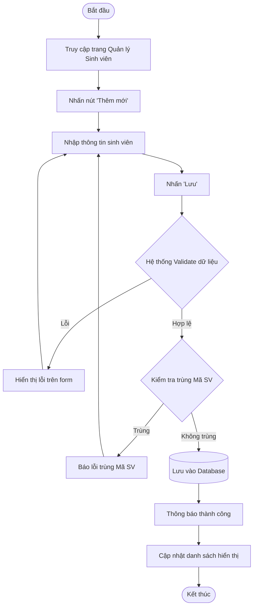
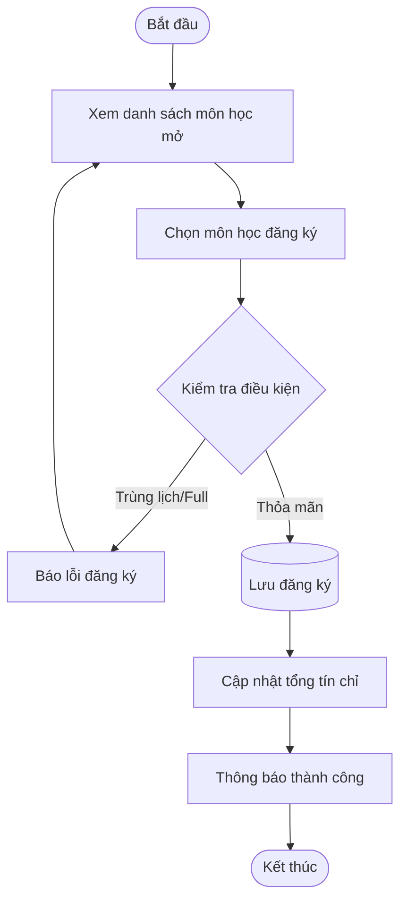

# BÁO CÁO BÀI TẬP LỚN KIỂM THỬ PHẦN MỀM
## ĐỀ TÀI: XÂY DỰNG VÀ KIỂM THỬ HỆ THỐNG QUẢN LÝ SINH VIÊN

---

## MỤC LỤC

1.  [CHƯƠNG 1: TỔNG QUAN BÀI TOÁN](#chương-1-tổng-quan-bài-toán)
    *   [1.1 Giới thiệu đề tài](#11-giới-thiệu-đề-tài)
    *   [1.2 Đặc tả yêu cầu](#12-đặc-tả-yêu-cầu)
2.  [CHƯƠNG 2: PHÂN TÍCH VÀ THIẾT KẾ TEST](#chương-2-phân-tích-và-thiết-kế-test)
    *   [2.1 Unit Test Case](#21-unit-test-case)
    *   [2.2 Integration Test Case](#22-integration-test-case)

---

# CHƯƠNG 1: TỔNG QUAN BÀI TOÁN

## 1.1 Giới thiệu đề tài

### Mục tiêu
Đề tài tập trung vào việc xây dựng và kiểm thử **Hệ thống Quản lý Sinh viên (Student Management System)**. Mục tiêu chính là số hóa quy trình quản lý đào tạo, giúp giảm thiểu sai sót thủ công, tiết kiệm thời gian và cung cấp công cụ báo cáo trực quan cho nhà trường.

### Nội dung cụ thể
*   **Tên đề tài:** Xây dựng và Kiểm thử Hệ thống Quản lý Sinh viên.
*   **Bối cảnh ứng dụng:** Hệ thống được áp dụng tại các trường đại học, cao đẳng hoặc trung tâm đào tạo để quản lý hồ sơ sinh viên, quá trình học tập và giảng dạy.
*   **Bài toán cần giải quyết:**
    *   **Quản lý dữ liệu tập trung:** Thay thế việc lưu trữ hồ sơ giấy hoặc file Excel rời rạc bằng cơ sở dữ liệu tập trung.
    *   **Tự động hóa quy trình:** Tự động tính điểm trung bình, xếp loại học lực, kiểm tra điều kiện đăng ký học phần.
    *   **Phân quyền truy cập:** Đảm bảo tính bảo mật và toàn vẹn dữ liệu thông qua cơ chế phân quyền rõ ràng cho Admin, Giảng viên và Sinh viên.

## 1.2 Đặc tả yêu cầu

### 1.2.1 Các luồng nghiệp vụ chính

Dưới đây là mô tả các luồng nghiệp vụ quan trọng nhất của hệ thống, kèm theo biểu đồ hoạt động (Activity Diagram).

#### a. Luồng Đăng nhập (Login Flow)
*   **Mô tả:** Người dùng truy cập hệ thống, nhập tên đăng nhập và mật khẩu. Hệ thống xác thực thông tin. Nếu đúng, chuyển hướng đến trang Dashboard tương ứng với quyền hạn. Nếu sai, thông báo lỗi.
*   **Biểu đồ:**


#### b. Luồng Quản lý Sinh viên (Thêm mới)
*   **Mô tả:** Admin hoặc Giảng viên truy cập trang quản lý sinh viên, chọn chức năng "Thêm mới". Nhập đầy đủ thông tin cá nhân và học vụ của sinh viên. Hệ thống kiểm tra tính hợp lệ (validation) và trùng lặp (mã SV). Nếu hợp lệ, lưu vào CSDL.
*   **Biểu đồ:**



#### c. Luồng Đăng ký Học phần (Sinh viên)
*   **Mô tả:** Sinh viên xem danh sách môn học đang mở, chọn môn muốn đăng ký. Hệ thống kiểm tra điều kiện (trùng lịch, số tín chỉ tối đa). Nếu thỏa mãn, ghi nhận đăng ký.
*   **Biểu đồ:**



#### d. Luồng Nhập điểm (Giảng viên)
*   **Mô tả:** Giảng viên chọn lớp và môn học phụ trách. Hệ thống hiển thị danh sách sinh viên. Giảng viên nhập điểm quá trình và cuối kỳ. Hệ thống tự động tính điểm tổng kết và xếp loại.
*   **Biểu đồ:**

```mermaid
graph TD
    Start([Bắt đầu]) --> SelectClass[Chọn Lớp & Môn học]
    SelectClass --> LoadList[Hiển thị danh sách sinh viên]
    LoadList --> InputScore[Nhập điểm GK & CK]
    InputScore --> AutoCalc[Hệ thống tính Điểm TB & Xếp loại]
    AutoCalc --> SaveScores[Nhấn 'Lưu bảng điểm']
    SaveScores --> ValidateScore{Validate điểm (0-10)}
    ValidateScore -- Sai --> ErrorScore[Báo lỗi định dạng]
    ErrorScore --> InputScore
    ValidateScore -- Đúng --> SaveDB[(Lưu vào Database)]
    SaveDB --> ShowSuccess[Thông báo thành công]
    ShowSuccess --> End([Kết thúc])
```

### 1.2.2 Các màn hình chức năng chính

#### a. Màn hình Đăng nhập (Login Screen)
*   **Wireframe:**
    *   Logo hệ thống ở chính giữa hoặc bên trái.
    *   Form đăng nhập gồm: Input Username, Input Password, Nút Đăng nhập.
    *   Thông báo lỗi hiển thị ngay dưới nút Đăng nhập nếu có.
*   **Mô tả các trường:**

| Tên trường | Kiểu dữ liệu | Độ dài tối đa | Bắt buộc | Default | Mô tả |
| :--- | :--- | :--- | :--- | :--- | :--- |
| Username | String | 50 | Có | - | Tên đăng nhập của người dùng |
| Password | String | 255 | Có | - | Mật khẩu (ẩn ký tự) |

*   **Điều kiện ràng buộc:**
    *   Username không được để trống.
    *   Password không được để trống.
    *   Nếu nhập sai quá 5 lần, khóa tài khoản tạm thời (tùy chọn nâng cao).

#### b. Màn hình Quản lý Sinh viên (Student List & Add/Edit)
*   **Wireframe:**
    *   Thanh tìm kiếm và bộ lọc (Lớp, Khoa) ở trên cùng.
    *   Nút "Thêm sinh viên" ở góc phải.
    *   Bảng danh sách sinh viên: Mã SV, Họ tên, Lớp, Khoa, Email, SĐT, Hành động (Sửa/Xóa).
    *   Modal/Popup form khi nhấn Thêm hoặc Sửa.
*   **Mô tả các trường (Form sinh viên):**

| Tên trường | Kiểu dữ liệu | Độ dài tối đa | Bắt buộc | Default | Mô tả |
| :--- | :--- | :--- | :--- | :--- | :--- |
| Mã SV | String | 20 | Có | - | Mã định danh duy nhất (Unique) |
| Họ tên | String | 100 | Có | - | Tên đầy đủ của sinh viên |
| Email | String | 100 | Có | - | Email liên hệ (đúng định dạng) |
| SĐT | String | 20 | Không | - | Số điện thoại |
| Ngày sinh | Date | - | Có | - | Ngày tháng năm sinh |
| Giới tính | Enum | - | Có | - | Nam/Nữ/Khác |
| Lớp | Select | - | Có | - | Chọn từ danh sách lớp có sẵn |
| Khoa | Select | - | Có | - | Chọn từ danh sách khoa có sẵn |

*   **Điều kiện ràng buộc:**
    *   **Mã SV:** Phải là duy nhất trong hệ thống. Không chứa ký tự đặc biệt.
    *   **Email:** Phải đúng định dạng email (regex: `^[^\s@]+@[^\s@]+\.[^\s@]+$`).
    *   **Ngày sinh:** Phải nhỏ hơn ngày hiện tại và đủ 18 tuổi (nếu có quy định).

#### c. Màn hình Nhập điểm (Grade Entry)
*   **Wireframe:**
    *   Dropdown chọn Khoa -> Lớp -> Môn học.
    *   Bảng danh sách sinh viên của lớp đã chọn.
    *   Các cột điểm: Điểm Giữa kỳ (Editable), Điểm Cuối kỳ (Editable), Điểm TB (Read-only), Xếp loại (Read-only).
    *   Nút "Lưu bảng điểm" ở cuối trang.
*   **Mô tả các trường:**

| Tên trường | Kiểu dữ liệu | Độ dài tối đa | Bắt buộc | Default | Mô tả |
| :--- | :--- | :--- | :--- | :--- | :--- |
| Điểm GK | Float | - | Không | 0 | Điểm kiểm tra giữa kỳ (0-10) |
| Điểm CK | Float | - | Không | 0 | Điểm thi cuối kỳ (0-10) |

*   **Điều kiện ràng buộc:**
    *   Điểm phải nằm trong khoảng [0, 10].
    *   Nhập sai định dạng (chữ cái) sẽ báo lỗi ngay tại ô nhập.
    *   Điểm TB tự động cập nhật khi thay đổi điểm thành phần.

### 1.2.3 Các module chính của chương trình

#### a. Module Xác thực (Authentication Module)
*   **Input:** Username, Password.
*   **Output:** Token xác thực (JWT), Thông tin User (Role, Name), Thông báo lỗi.
*   **Chức năng:**
    *   Kiểm tra thông tin đăng nhập so với cơ sở dữ liệu.
    *   Cấp quyền truy cập (Authorization) dựa trên vai trò (Admin/Teacher/Student).
    *   Quản lý phiên làm việc (Session/Token).

#### b. Module Quản lý Sinh viên (Student Management Module)
*   **Input:** Thông tin sinh viên (Mã, Tên, Email...), Tiêu chí tìm kiếm/lọc.
*   **Output:** Danh sách sinh viên, Thông báo thành công/thất bại khi CRUD.
*   **Chức năng:**
    *   Hiển thị danh sách sinh viên phân trang.
    *   Thêm mới, cập nhật, xóa hồ sơ sinh viên.
    *   Tìm kiếm và lọc sinh viên theo nhiều tiêu chí.
    *   Kiểm tra tính hợp lệ của dữ liệu đầu vào (Validate).

#### c. Module Quản lý Điểm (Grade Management Module)
*   **Input:** Điểm số (GK, CK), Mã sinh viên, Mã môn học.
*   **Output:** Bảng điểm chi tiết, Điểm trung bình, Xếp loại học lực.
*   **Chức năng:**
    *   Cho phép giảng viên nhập điểm cho từng sinh viên.
    *   Tự động tính toán điểm trung bình theo công thức: `(GK * 0.3) + (CK * 0.7)`.
    *   Tự động xếp loại dựa trên điểm trung bình (Xuất sắc, Giỏi, Khá...).
    *   Lưu trữ lịch sử điểm số.

#### d. Module Đăng ký Học phần (Enrollment Module)
*   **Input:** Môn học được chọn, Mã sinh viên.
*   **Output:** Kết quả đăng ký (Thành công/Thất bại), Thời khóa biểu cá nhân.
*   **Chức năng:**
    *   Hiển thị danh sách các môn học đang mở cho đăng ký.
    *   Xử lý logic đăng ký: Kiểm tra trùng lịch, kiểm tra sĩ số lớp, kiểm tra tiên quyết (nếu có).
    *   Cho phép hủy đăng ký trong thời gian quy định.

---

# CHƯƠNG 2: PHÂN TÍCH VÀ THIẾT KẾ TEST

## 2.1 Unit Test Case

### 2.1.1 Phương pháp, kỹ thuật

Trong quá trình kiểm thử đơn vị (Unit Testing), nhóm đã áp dụng các kỹ thuật thiết kế test case sau để đảm bảo độ bao phủ và tính chính xác của mã nguồn:

1.  **Phân hoạch tương đương (Equivalence Partitioning):**
    *   **Áp dụng:** Chia dữ liệu đầu vào thành các lớp tương đương (hợp lệ và không hợp lệ).
    *   **Ví dụ:**
        *   Kiểm thử chức năng đăng nhập: Chia thành nhóm tài khoản hợp lệ (đúng username/password) và nhóm tài khoản không hợp lệ (sai password, user không tồn tại).
        *   Kiểm thử tính điểm GPA: Chia thành nhóm có điểm (danh sách grades không rỗng) và nhóm không có điểm (mảng rỗng hoặc null).

2.  **Phân tích giá trị biên (Boundary Value Analysis):**
    *   **Áp dụng:** Tập trung kiểm thử các giá trị ở biên của miền dữ liệu, nơi thường xuyên xảy ra lỗi.
    *   **Ví dụ:**
        *   Kiểm thử hàm `calculateGPA`: Kiểm tra trường hợp sinh viên có điểm trung bình 0.0 (biên dưới) hoặc 4.0 (biên trên).
        *   Kiểm thử nhập điểm: Nhập giá trị 0, 10, -1, 11.

3.  **Kiểm thử chuyển đổi trạng thái (State Transition Testing):**
    *   **Áp dụng:** Kiểm tra sự thay đổi trạng thái của hệ thống hoặc đối tượng.
    *   **Ví dụ:** Kiểm thử `AuthContext`:
        *   Trạng thái ban đầu: `isAuthenticated = false`.
        *   Hành động Login thành công -> `isAuthenticated = true`.
        *   Hành động Logout -> `isAuthenticated = false`.

4.  **Phủ đảm bảo câu lệnh (Statement Coverage):**
    *   **Áp dụng:** Đảm bảo mọi dòng lệnh trong các hàm tiện ích (`utils/helpers.js`) đều được thực thi ít nhất một lần qua các test case.

### 2.1.2 Danh sách các test case

Dưới đây là danh sách các Unit Test Case chi tiết được trích xuất từ mã nguồn kiểm thử (`src/utils/helpers.test.js` và `src/contexts/AuthContext.test.jsx`).

| ID | Tên Test Case | Mô tả | Dữ liệu đầu vào | Các bước thực hiện | Kết quả mong đợi |
| :--- | :--- | :--- | :--- | :--- | :--- |
| **UT-01** | CalculateGPA_Empty | Tính GPA với danh sách điểm rỗng hoặc null | `grades = []` hoặc `null` | 1. Gọi hàm `calculateGPA(grades)` | Trả về `0` |
| **UT-02** | CalculateGPA_Mixed | Tính GPA với các điểm số khác nhau | `grades = [{avg: 9.0, cred: 3}, {avg: 7.5, cred: 4}, {avg: 6.0, cred: 3}]` | 1. Gọi hàm `calculateGPA(grades)` | Trả về `"3.00"` (Chính xác theo công thức tín chỉ) |
| **UT-03** | CalculateGPA_MissingCredits | Tính GPA khi thiếu thông tin tín chỉ | `grades = [{avg: 8.5}]` | 1. Gọi hàm `calculateGPA(grades)`<br>*(Hệ thống tự gán tín chỉ mặc định = 3)* | Trả về `"4.00"` (Quy đổi điểm 8.5 -> A -> 4.0) |
| **UT-04** | CalculateGPA_Failing | Tính GPA với điểm trượt (F) | `grades = [{avg: 3.0, cred: 3}]` | 1. Gọi hàm `calculateGPA(grades)` | Trả về `"0.00"` |
| **UT-05** | FormatDate_Valid | Định dạng ngày hợp lệ | `date = "2023-01-01"` | 1. Gọi hàm `formatDate(date)` | Trả về `"01/01/2023"` |
| **UT-06** | FormatDate_Null | Định dạng ngày null/undefined | `date = null` | 1. Gọi hàm `formatDate(date)` | Trả về `""` (Chuỗi rỗng) |
| **UT-07** | Auth_InitialState | Kiểm tra trạng thái khởi tạo AuthContext | Không có | 1. Render `AuthProvider`<br>2. Kiểm tra giá trị `user` và `isAuthenticated` | `user` là `null`<br>`isAuthenticated` là `false` |
| **UT-08** | Auth_Login_Success_Admin | Đăng nhập thành công với quyền Admin | `username="admin"`, `password="admin123"` | 1. Gọi hàm `login("admin", "admin123")` | Trả về `success: true`<br>`user.username` là "admin"<br>`isAdmin` là `true` |
| **UT-09** | Auth_Login_Success_Student | Đăng nhập thành công với quyền Student | `username="student"`, `password="student123"` | 1. Gọi hàm `login("student", "student123")` | Trả về `success: true`<br>`user.username` là "student"<br>`isStudent` là `true` |
| **UT-10** | Auth_Login_Fail_WrongPass | Đăng nhập thất bại do sai mật khẩu | `username="admin"`, `password="wrong"` | 1. Gọi hàm `login("admin", "wrong")` | Trả về `success: false`<br>Thông báo lỗi xuất hiện<br>`isAuthenticated` vẫn là `false` |
| **UT-11** | Auth_Logout | Đăng xuất khỏi hệ thống | Đang ở trạng thái đã đăng nhập | 1. Gọi hàm `logout()` | `user` trở về `null`<br>`isAuthenticated` trở về `false`<br>LocalStorage bị xóa |
| **UT-12** | Auth_RestoreSession | Khôi phục phiên làm việc từ LocalStorage | `localStorage` có chứa thông tin user | 1. Khởi tạo `AuthProvider`<br>2. Chờ `useEffect` chạy | `user` được khôi phục từ localStorage<br>`isAuthenticated` là `true` |

## 2.2 Integration Test Case

### 2.2.1 Phương pháp, kỹ thuật

Đối với kiểm thử tích hợp (Integration Testing), nhóm áp dụng phương pháp **Incremental Integration** (Tích hợp tăng dần), cụ thể là kết hợp giữa Top-down và Bottom-up tùy theo từng phân hệ chức năng:

1.  **Chiến lược Tích hợp:**
    *   **Tích hợp UI - Logic (Top-down):** Kiểm thử sự tương tác giữa các thành phần giao diện (Pages/Components) với các Context/State Management (AuthContext). Bắt đầu từ các trang chính (Login, Dashboard) xuống các thành phần con.
    *   **Tích hợp Logic - Data (Bottom-up):** Kiểm thử các hàm xử lý dữ liệu (Helpers) tích hợp với các luồng nghiệp vụ chính trước khi gắn vào giao diện.

2.  **Kỹ thuật thiết kế Test Case:**
    *   **Scenario-based Testing:** Thiết kế kịch bản dựa trên luồng nghiệp vụ thực tế (Use Case Scenarios).
    *   **Data Flow Testing:** Kiểm tra luồng dữ liệu di chuyển giữa các module (Ví dụ: Từ form nhập liệu -> Context -> LocalStorage -> Hiển thị lại trên UI).

### 2.2.2 Danh sách các test case

Dưới đây là danh sách các Integration Test Case tập trung vào sự giao tiếp giữa các module chính:

| ID | Tên Test Case | Module tích hợp | Dữ liệu đầu vào | Điều kiện | Các bước thực hiện | Kết quả mong đợi |
| :--- | :--- | :--- | :--- | :--- | :--- | :--- |
| **INT-01** | Login_Flow_Integration | `LoginPage` <-> `AuthContext` <-> `LocalStorage` | User: `admin` / `admin123` | Chưa đăng nhập | 1. Nhập credentials vào Form Login.<br>2. Nhấn Submit. | 1. `AuthContext` cập nhật state `user`.<br>2. Token/User được lưu vào `LocalStorage`.<br>3. Chuyển hướng sang trang `Dashboard`. |
| **INT-02** | ProtectedRoute_Access | `PrivateRoute` <-> `AuthContext` <-> `Router` | URL: `/students` | Chưa đăng nhập | 1. Truy cập trực tiếp URL `/students`. | 1. `PrivateRoute` kiểm tra `isAuthenticated` = false.<br>2. Hệ thống chuyển hướng về `/login`. |
| **INT-03** | RoleBased_Access_Student | `Sidebar` <-> `AuthContext` | User: `student` | Đã đăng nhập là Student | 1. Truy cập Dashboard.<br>2. Kiểm tra Menu Sidebar. | 1. `AuthContext` cung cấp role `student`.<br>2. Sidebar **ẩn** các menu: Sinh viên, Môn học, Lớp học.<br>3. Sidebar **hiện** menu: Điểm của tôi, Đăng ký HP. |
| **INT-04** | Student_Add_Integration | `StudentPage` <-> `StudentForm` <-> `DataStore` | Info: "SV_New", "Nguyen Van A" | Login as Admin | 1. Mở form Thêm sinh viên.<br>2. Nhập dữ liệu hợp lệ.<br>3. Nhấn Lưu. | 1. Dữ liệu được validate tại Form.<br>2. Dữ liệu mới được thêm vào danh sách hiển thị (State update).<br>3. Modal đóng lại và thông báo thành công. |
| **INT-05** | Grade_Entry_Calculation | `GradesPage` <-> `Helper(calculateGPA)` | Điểm: GK=8, CK=9 | Login as Teacher | 1. Chọn sinh viên.<br>2. Nhập điểm GK=8, CK=9.<br>3. Hệ thống tự động tính toán. | 1. Hàm `calculateGPA` được gọi.<br>2. Ô "Điểm TB" tự động cập nhật giá trị `8.7`.<br>3. Ô "Xếp loại" cập nhật tương ứng. |
| **INT-06** | Enrollment_Check_Conflict | `EnrollmentPage` <-> `ValidationLogic` | Môn học: "Lập trình Web" | Đã đăng ký môn này rồi | 1. Chọn môn "Lập trình Web".<br>2. Nhấn Đăng ký. | 1. Logic kiểm tra phát hiện trùng lặp.<br>2. Hiển thị thông báo lỗi: "Môn học đã được đăng ký".<br>3. Không lưu dữ liệu mới. |
| **INT-07** | Search_Filter_Integration | `StudentList` <-> `SearchComponent` | Keyword: "Nguyen" | Danh sách có dữ liệu | 1. Nhập "Nguyen" vào ô tìm kiếm. | 1. State `searchTerm` cập nhật.<br>2. Danh sách sinh viên được lọc lại chỉ còn các bản ghi chứa "Nguyen". |
